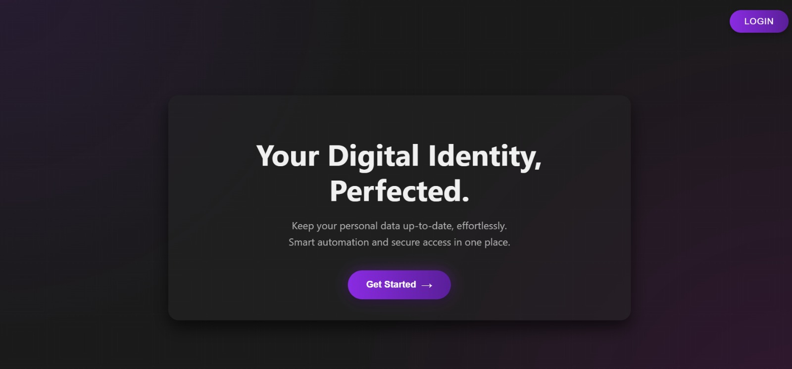
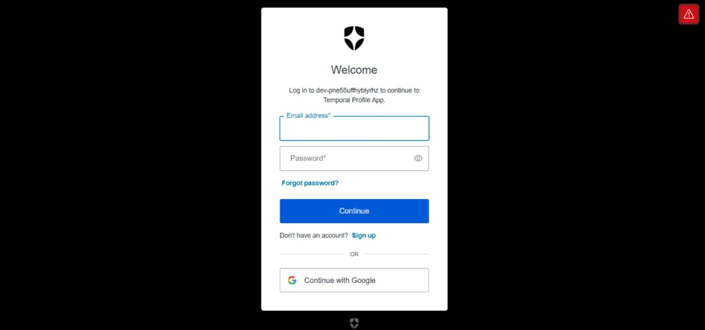
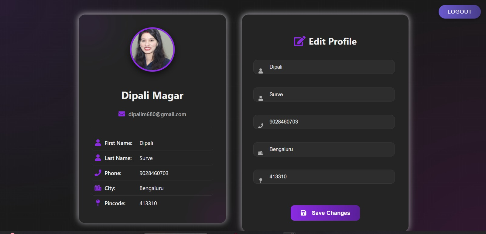
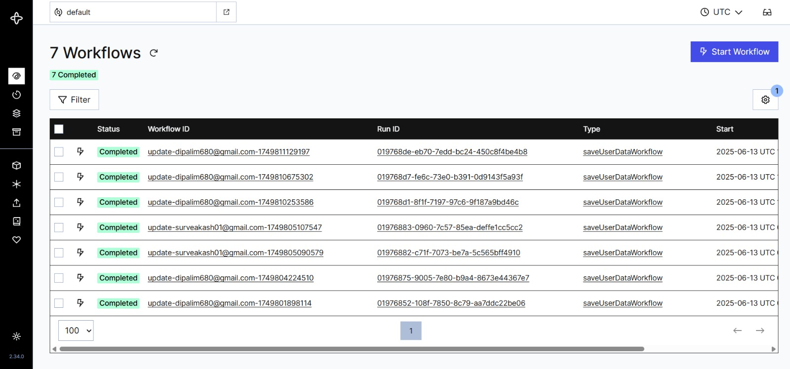
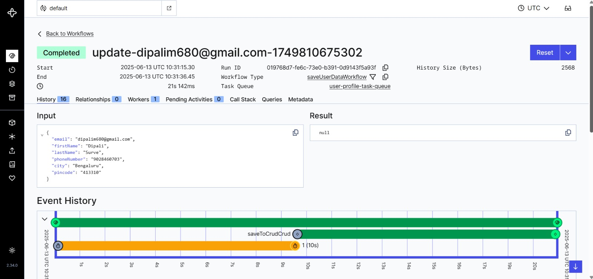

# 👤 Profile-Temporal-App (MERN + Temporal + Auth0)

A full-stack **MERN** application enhanced with **Temporal.io** and **Auth0** to manage user profiles. It securely handles user updates via Temporal Workflows and syncs user data with external APIs like [CrudCrud](https://crudcrud.com).

## 📸 Preview

### 🔹 Home Page



### 🔹 Authentication Page

## 

### 🔹 Profile Page

## 

## 🚀 Tech Stack

### 🖥️ Frontend

- React.js (Vite)
- Auth0
- Axios, Plain CSS

### 🛠 Backend

- Node.js + Express.js
- MongoDB + Mongoose
- Temporal.io (Workflows, Workers, Activities)
- Axios, dotenv, cors

---

---

## ✨ Features

- 🔐 **Secure Login via Auth0 (OIDC):**  
  Users authenticate through Auth0, a secure identity federator based on OpenID Connect (OIDC).

- 👤 **Personalized User Profile:**  
  After logging in, users can view and manage their personal profile.

- 📝 **Editable Profile Fields:**  
  Users can update:

  - First Name
  - Last Name
  - Phone Number
  - City
  - Pincode

- 💾 **Database Persistence using Temporal Workflows:**  
  On editing their profile, user data is saved to MongoDB through a **Temporal workflow**.

- ⏱️ **Delayed Sync with CrudCrud (10 seconds):**  
  After the database update, the same data is sent to [CrudCrud](https://crudcrud.com/) with a **10-second delay**, managed inside the Temporal workflow.

- 🐳 **Temporal Setup with Docker:**  
  Temporal server is configured using Docker.

- ⚛️ **MERN Stack Application:**

  - **Frontend:** React (Vite)
  - **Backend:** Node.js, Express.js
  - **Database:** MongoDB
  - **Workflow Engine:** Temporal.io

- 🎨 **User-Friendly Interface:**  
  Clean, responsive UI for profile management and editing.

---

## 🔐 Authentication with Auth0

## 🔐 Auth0 Configuration

Create an app in Auth0 dashboard.

### Allowed URLs to Set

- **Allowed Callback URLs**: `http://localhost:5173`
- **Allowed Logout URLs**: `http://localhost:5173`
- **Allowed Web Origins**: `http://localhost:5173`

Add your client ID, domain and secret in your frontend `.env` file:

```
VITE_AUTH0_DOMAIN=dev-xxxxxxx.us.auth0.com
VITE_AUTH0_CLIENT_ID=yourClientId
```

- Frontend login/logout using Auth0's React SDK.

---

---

## Temoral.io setup

## step 1 - install the docker

companyAssignments/
└── profiletemporal/

cd path/to/companyAssignments

## step 2 - clone temporal's docker compose setup using official repo

git clone https://github.com/temporalio/docker-compose.git temporal-server

So this will create temporal-server

companyAssignments/
├── profiletemporal/ ← your app
└── temporal-server/ ← Temporal server with Docker Compose

## Step 3: Start Temporal using Docker Compose

1. Move into the cloned Temporal server directory:

`cd temporal-server`

2. Start the Temporal server using Docker Compose:

`docker-compose up`

This will:

Start all required Temporal services (frontend, matching, history, worker)

Start a Temporal Web UI (default port: http://localhost:8233)

Open your browser and visit: http://localhost:8233 — you should see the Temporal Web UI

if you get any error
Try Pulling the Image Manually

`docker pull postgres:16`

Run Temporal Docker Services

`docker-compose up`

Open your browser and visit: http://localhost:8233 — you should see the Temporal Web UI

## Temporal Dashboard with Workflows

### 🔹 Workflows

## 

### 🔹 Workflows Details

## 

---

## 🧪 API Endpoints

| Method | Endpoint        | Auth | Description                                   |
| ------ | --------------- | ---- | --------------------------------------------- |
| GET    | `/users`        | ❌   | Get all users (dev only)                      |
| GET    | `/users/:email` | ✅   | Get user profile by email                     |
| POST   | `/users/login`  | ✅   | Create/login user if not already present      |
| PUT    | `/users/:email` | ✅   | **Triggers Temporal Workflow to update user** |

### 🔁 PUT `/users/:email`

- Starts a Temporal Workflow that:
  - Waits 10 seconds
  - Updates user in MongoDB
  - Sends updated data to [CrudCrud](https://crudcrud.com)

### Sample PUT Body

```json
{
  "firstName": "Dipali",
  "lastName": "Surve",
  "city": "Bengaluru",
  "phoneNumber": "9028460703",
  "pincode": "413310"
}
```

```

Profile-Temporal-App/
│
├── client/               # React frontend (with Auth0)
├── server/
│   ├── config/           # MongoDB connection
│   ├── controllers/      # userController.js
│   ├── routes/           # userRoute.js
│   ├── temporal/
│   │   ├── activities.js # Activity to update MongoDB & CrudCrud
│   │   ├── workflows.js  # Workflow to delay + call activity
│   │   └── worker.js     # Temporal Worker
│   └── server.js          # Express server
│
|
└── README.md             # This file


```

```bash
git clone https://github.com/Dipali2377/Profile-Temporal-App.git
cd Profile-Temporal-App
```

---

## 👩‍💻 Author

**Dipali Magar**  
💼 MERN Stack Developer  
🔗 [GitHub Profile](https://github.com/Dipali2377)
